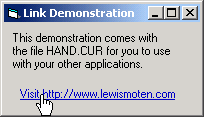



## Hyperlink with Hand Icon

### Description

Includes demonstration of how to make labels appear as hyperlinks, open the users default web browser, and uses a hand cursor when hovering over the icon. The hand.cur file is loaded seperately so that you may incorporate it into your other applications.
 
### More Info
 

             |
---                |---
**Submitted On**   |2002-06-04 20:59:28
**By**             |[Lewis E\. Moten III](https://github.com/Planet-Source-Code/PSCIndex/blob/master/ByAuthor/lewis-e-moten-iii.md)
**Level**          |Beginner
**User Rating**    |4.8 (24 globes from 5 users)
**Compatibility**  |VB 6\.0
**Category**       |[Custom Controls/ Forms/  Menus](https://github.com/Planet-Source-Code/PSCIndex/blob/master/ByCategory/custom-controls-forms-menus__1-4.md)
**World**          |[Visual Basic](https://github.com/Planet-Source-Code/PSCIndex/blob/master/ByWorld/visual-basic.md)
**Archive File**   |[Hyperlink\_90330642002\.zip](https://github.com/Planet-Source-Code/lewis-e-moten-iii-hyperlink-with-hand-icon__1-35482/archive/master.zip)

